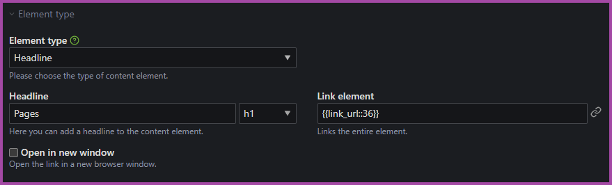

<h1 align="center">Contao Linked Elements</h1>

    

Thx 2 https://github.com/zoglo for preparing code for Contao 5

---

> Working with **Contao 4.13** and **Contao 5+** (PHP ^8.1)

---

## Description

Allows linking every content element by wrapping the content with an `<a>` tag
